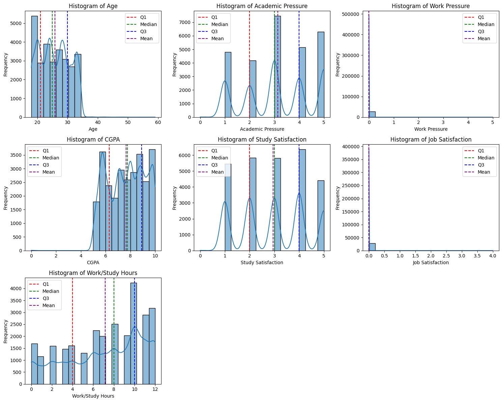
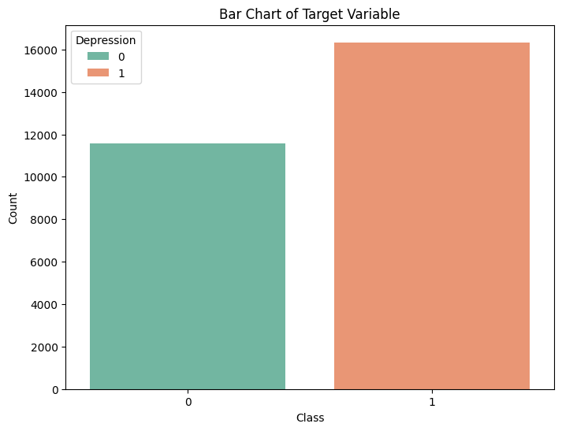
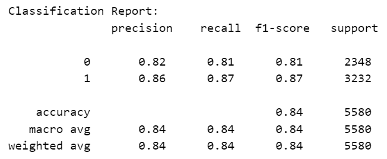
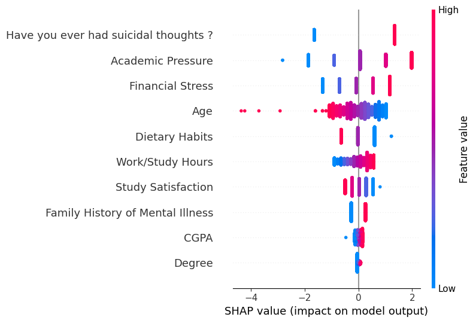

# Laporan Proyek Machine Learning - Dwi Cahya Nurani

## Domain Proyek
Masa sekolah, khususnya perkuliahan, merupakan periode transisi dalam kehidupan seorang individu. Siswa dihadapkan pada berbagai tantangan baru, mulai dari tuntutan akademik yang tinggi, adaptasi dengan lingkungan sosial yang baru, tekanan finansial, hingga ekspektasi akan masa depan. Kombinasi dari tekanan-tekanan ini menjadikan siswa sebagai kelompok yang rentan mengalami masalah kesehatan mental, salah satunya adalah depresi.

Tingginya kerentanan ini tercermin dalam data prevalensi depresi yang mengkhawatirkan. Riset Kesehatan Dasar (Riskesdas) tahun 2018 menyatakan bahwa 6,2% penduduk Indonesia berusia 15-24 tahun mengalami depresi. Sebuah penelitian oleh Arif Tri Setyanto (2023) menemukan bahwa dari sejumlah sampel yang diteliti, 25% mahasiswa mengalami depresi dalam berbagai tingkatan, di samping 29% yang mengalami gangguan kecemasan. Bahkan, laporan terbaru oleh Kementerian Kesehatan RI menyoroti bahwa 22,4% mahasiswa Program Pendidikan Dokter Spesialis (PPDS) terdeteksi mengalami gejala depresi (Kompas, 2024).

Depresi bukan sekadar perasaan sedih. Depresi membawa dampak negatif yang luas dan berpotensi merusak berbagai aspek kehidupan mahasiswa. Secara personal, depresi dapat memicu rasa putus asa, hilangnya kepercayaan diri, perasaan tertekan, gangguan gizi, hingga yang paling fatal, munculnya ide atau tindakan bunuh diri (Putri et al., 2022). Dampak ini merembet ke ranah akademik, di mana depresi seringkali berkorelasi dengan penurunan milai atau Indeks Prestasi Kumulatif (IPK), peningkatan absensi, kesulitan berkonsentrasi, hilangnya motivasi belajar, dan meningkatnya risiko drop out. Hal ini tentu mengganggu kualitas hidup siswa, mempengaruhi hubungan sosial dengan teman dan keluarga, serta meningkatkan risiko perilaku berbahaya seperti penyalahgunaan zat dan bahkan ide atau percobaan bunuh diri.

Melihat dampak serius tersebut, sangat penting untuk melakukan deteksi dini dan intervensi yang tepat terhadap depresi pada siswa. Namun, upaya deteksi dini ini menghadapi berbagai hambatan. Metode tradisional seringkali bergantung pada kesadaran dan inisiatif mahasiswa untuk mencari bantuan, yang sayangnya masih rendah. Stigma seputar kesehatan mental, keterbatasan akses ke layanan konseling atau psikolog profesional, serta ketidaktahuan siswa akan gejala yang mereka alami menjadi penghalang utama. Hal ini diperkuat oleh data Kementerian Kesehatan (2024) yang menyebutkan bahwa hanya 10,4% anak muda dengan depresi yang mencari pengobatan, menjadikan kelompok usia ini sebagai yang paling sedikit mendapatkan penanganan meskipun prevalensinya tinggi.

Untuk mengatasi kesenjangan ini, teknologi *machine learning* menawarkan sebuah solusi. Dengan kemampuannya menganalisis pola kompleks dari data dalam jumlah besar, machine learning dapat membantu mengidentifikasi faktor-faktor risiko dan pola perilaku yang berkorelasi dengan depresi. Penelitian oleh Haque, Kabir, dan Khanam (2021), misalnya, telah menunjukkan potensi machine learning dalam mengidentifikasi pemicu depresi pada anak-anak dan remaja, membuka jalan untuk intervensi yang lebih cepat dan personal.

Proyek ini bertujuan untuk mengembangkan model prediksi depresi pada siswa dengan memanfaatkan dataset yang ada (Student Depression Dataset) dan teknik *machine learning*. Dengan menggunakan dataset yang tersedia dan teknik *machine learning*, proyek ini berpotensi memberikan kontribusi nyata dalam upaya meningkatkan kesejahteraan mental siswa di lingkungan pendidikan. 

## Business Understanding
### Problem Statements
Berdasarkan latar belakang yang telah diuraikan, berikut adalah beberapa masalah utama yang akan menjadi fokus dalam proyek ini:
- Metode <ins> deteksi dini depresi yang ada saat ini kurang efektif </ins> dalam menjangkau seluruh populasi siswa, sehingga banyak kasus depresi yang tidak terdeteksi atau terlambat ditangani.
- Belum adanya pemahaman mendalam berbasis data mengenai <ins> faktor-faktor utama yang menjadi prediktor kuat risiko depresi </ins> pada populasi siswa.

### Goals
Berdasarkan pernyataan masalah di atas, tujuan utama dari proyek analisis prediksi ini adalah:
Menjelaskan tujuan dari pernyataan masalah:
- Mengembangkan <ins> model prediksi </ins> yang mampu mengidentifikasi siswa dengan risiko depresi tinggi secara dini.
- Menganalisis dan mengidentifikasi <ins> faktor-faktor risiko paling signifikan </ins> yang berkontribusi terhadap depresi pada siswa berdasarkan data.

### Solution statements
- Membangun dan <ins> membandingkan kinerja beberapa model </ins> klasifikasi *machine learning* untuk memprediksi status depresi siswa berdasarkan fitur-fitur yang ada dalam dataset. Kinerja setiap model akan dievaluasi menggunakan metrik-metrik evaluasi untuk masalah klasifikasi, yaitu *accuracy*, *precision*, *recall*, *F1-score*, dan AUC-ROC.
- Melakukan <ins> optimasi *hyperparameter* </ins> pada model *machine learning* terpilih menggunakan teknik Randomized Search dengan Cross-Validation. Langkah ini bertujuan untuk meningkatkan performa *baseline* model dan memastikan generalisasinya pada data baru. Peningkatan performa akan diukur berdasarkan peningkatan nilai metrik evaluasi pada *test set* dibandingkan dengan baseline model. Selain itu, akan dilakukan analisis *feature importance* untuk mengidentifikasi prediktor kunci.

## Data Understanding
Data yang digunakan dalam proyek analisis prediksi kesehatan mental (depresi) mahasiswa ini adalah **"Student Depression Dataset"**. Dataset ini bersumber dari platform Kaggle yang dapat diakses pada tautan [Student Depression Dataset](https://www.kaggle.com/datasets/adilshamim8/student-depression-dataset/data). Dataset ini berisi 27.901 data record siswa dengan 18 fitur yang mencakup informasi demografis, akademik, dan indikator kesehatan mental. Tujuan utama dataset ini adalah untuk menyediakan data bagi penelitian dan pengembangan model yang dapat mengidentifikasi faktor-faktor terkait depresi di kalangan siswa.

### Variabel-variabel pada Student Depression dataset adalah sebagai berikut:
- `ID` : Nomor identifikasi unik untuk setiap siswa.
- `Age` : Usia siswa dalam tahun.
- `Gender` : Jenis kelamin siswa.
- `City` : Kota atau wilayah tempat tinggal siswa.
- `CGPA` : Indeks Prestasi Kumulatif (IPK) siswa.
- `Academic Pressure` : Ukuran yang menunjukkan tingkat tekanan yang dihadapi siswa dalam lingkungan akademik.
- `Study Satisfaction` : Indikator seberapa puas siswa dengan studinya.
- `Sleep Duration` : Jumlah rata-rata jam tidur siswa per hari.
- `Dietary Habits` : Penilaian terhadap pola makan dan kebiasaan nutrisi siswa.
- `Work Pressure` : Ukuran tekanan yang terkait dengan pekerjaan atau tanggung jawab pekerjaan, relevan bagi siswa yang bekerja sambil kuliah.
- `Job Satisfaction` : Ukuran kepuasan siswa dengan pekerjaan atau lingkungan kerjanya
- `Work/Study Hours` : Jumlah rata-rata jam per hari yang didedikasikan siswa untuk bekerja atau belajar.
- `Profession` : Bidang pekerjaan atau studi siswa.
- `Degree` : Gelar atau program akademik yang sedang ditempuh siswa.
- `Financial Stress` : Ukuran stres yang dialami karena kekhawatiran finansial.
- `Family History of Mental Illness` : Menunjukkan apakah ada riwayat penyakit mental dalam keluarga (Ya/Tidak).
- `Have you ever had suicidal thoughts?` : Indikator biner (Ya/Tidak) yang mencerminkan apakah siswa pernah mengalami ideasi bunuh diri.
- `Depression` : Variabel target yang menunjukkan apakah siswa mengalami depresi (Ya/Tidak).

### Exploratory Data Analysis (EDA)
Untuk memahami data lebih dalam, beberapa langkah Exploratory Data Analysis (EDA) awal akan dilakukan. Tahapan ini bertujuan untuk memeriksa kualitas data, memahami distribusi data, dan mengidentifikasi hubungan antarvariabel. 

1. **Kualitas Data** \
   Data yang digunakan terdiri dari 27.901 baris data dan 18 kolom fitur. Data awal terdiri dari 9 variabel kategorik dan 9 variabel numerik. Data tidak mengandung missing value dan tidak terdapat data terduplikat. 
2. **Distribusi Data** 
   - <ins> Histogram Variabel Numerik </ins> \
   
     Secara keseluruhan, histogram di atas memberikan gambaran mengenai distribusi berbagai variabel numerik dalam dataset. Garis-garis vertikal menunjukkan Kuartil 1 (Q1), Median (Q2), Kuartil 3 (Q3), dan Rata-rata (Mean). Dari histogram dapat diketahui bahwa dataset mencakup siswa dengan rentang usia 18-30 tahun. Banyak variabel seperti tekanan akademik dan kepuasan studi menggunakan skala rating.Faktor pekerjaan (tekanan dan kepuasan) tidak relevan bagi sebagian besar sampel, karena mayoritas siswa tidak bekerja. Kemudian, IPK dan jam belajar menunjukkan pola yang bervariasi di antara siswa. 
   - <ins> Bar Chart Variabel Kategorik </ins> \
   
     Secara keseluruhan, bar chart di atas menggambarkan distribusi frekuensi dari berbagai variabel kategori dalam dataset. Dari bar chart dapat diketahui bahwa dataset didominasi oleh siswa kelas 12 dengan distribusi gender yang cukup seimbang dan berasal dari berbagai kota. Banyak siswa mengalami kekurangan tidur, kebiasaan makan yang kurang baik, stres finansial, dan yang paling mencolok, tingginya prevalensi ideasi bunuh diri serta riwayat keluarga dengan penyakit mental.
3. **Korelasi Antar Variabel Numerik** \
   
   Berdasarkan heatmap di atas, terlihat tidak ada hubungan linear yang kuat antara sebagian besar  variabel, kecuali antara `Work Pressure` dan `Job Satisfaction`. Hal ini menunjukkan bahwa untuk memahami hubungan yang lebih kompleks (non-linear) mungkin diperlukan teknik analisis yang lebih canggih atau pertimbangan interaksi antar variabel, karena korelasi linear sederhana tidak banyak memberikan informasi.

## Data Preparation
1. **Data Cleaning** \
   Tahap ini melibatkan penanganan  masalah dalam data mentah dan dilakukan untuk menjamin kualitas data. Pada tahap ini dilakukan penghapusan kolom `ID` karena variabel ini tidak memberikan informasi yang bermanfaat dalam prediksi. Kemudian dilakukan penghapusan baris yang memiliki nilai '?' pada kolom `Financial Stress`. Dari tahap EDA diketahui bahwa terdapat 3 baris data yang memiliki nilai '?' pada kolom `Financial Stress`. Oleh karena itu, baris dihapus karena jumlahnya tidak signifikan dibandingan total keseluruhan data, sehingga data saat ini berjumlah 27.898 baris.
2. **Feature Encoding** \
   Feature Encoding diperlukan agar algoritma *machine learning* dapat memproses dan memahami fitur-fitur kategorikal. Pada tahap ini, proses encoding dibagi menjadi empat tahap, meliputi:
   - Ordinal Encoding \ 
     Diterapkan pada fitur ordinal yang memiliki urutan jelas, yaitu `Sleep Duration`, `Dietary Habits`, dan `Degree`. 
   - One-Hot Encoding \
     Diterapkan pada fitur nominal yang tidak memiliki urutan, yaitu `Profession`. Profesi yang jarang (<10 data dengan profesi tersebut) akan digabungkan menjadi bernilai 'Others'. 
   - Label Encoding \
     Diterapkan pada fitur ordinal yang memiliki dua nilai (biner), yaitu `Gender`, `Have you ever had suicidal thoughts ?`, dan `Family History of Mental Illness`.
   - Frequency Encoding \
     Diterapkan pada fitur dengan kardinalitas tinggi, yaitu `City`.
   Fitur `Financial Stress` yang awalnya sudah dalam nilai angka hanya perlu diubah tipe datanya menjadi numerik. 
3. **Feature Selection** \
   Tahap ini bertujuan untuk memilih subset fitur yang paling relevan dan informatif untuk memprediksi depresi. Digunakan metode filter berbasis uji statistik, yaitu ANOVA F-test, untuk memiliki 10 fitur teratas yang memiliki hubungan statistik terkuat dengan variabel target. Terpilih 10 fitur teratas, yaitu:
   > `Age`, `Academic Pressure`, `CGPA`, `Study Satisfaction`, `Dietary Habits`, `Degree`, `Have you ever had suicidal thoughts ?`, `Work/Study Hours`, `Financial Stress`, `Family History of Mental Illness`
   
   Fitur tersebut yang akan digunakan dalam tahap modeling. Pemilihan fitur penting untuk mengurangi kompleksitas model, menghindari overfitting, meningkatkan kecepatan training model, dan meningkatkan interpretasi model dengan fokus pada prediktor yang paling berpengaruh.
4. **Feature Scaling** \
   Tahap ini bertujuan untuk menyeragamkan rentang nilai fitur-fitur numerik, yaitu `Age`, `CGPA`, dan `Work/Study Hours`. Metode yang akan digunakan adalah StandardScaler, yang mengubah data sehingga memiliki rata-rata 0 dan standar deviasi 1. Scaling dilakukan setelah membagi data menjadi data train (80%) dan data test (20%) untuk menghindari *data leakage*. 
5. **Imbalance Handling** \
   
   Dari proses EDA diketahui bahwa distribusi kelas pada variabel target tidak seimbang. Jika dataset tidak seimbang, model cenderung menjadi bias terhadap kelas mayoritas dan memiliki performa yang buruk dalam memprediksi kelas minoritas. Oleh karena itu, akan dilakukan penanganan dengan metode SMOTETomek yang merupakan teknik *resampling* gabungan antara SMOTE (Synthetic Minority Over-sampling Technique) dan Tomek Links. Teknik ini hanya diterapkan pada data train untuk mencegah *data leakage*. Diperoleh hasil sebagai berikut:

   > Distribusi kelas sebelum penanganan: \
     1  : 13103 \
     0  : 9215

   > Distribusi kelas setelah penanganan: \
     1  : 12341 \
     0  : 12341

## Modeling
Sesuai dengan *goals* yang telah ditetapkan, tahapan ini melibatkan eksperimen dengan berbagai algoritma dan penyetelan parameter untuk mendapatkan performa terbaik. Berdasarkan *Solution Statements* yang mengusulkan penggunaan dua atau lebih algoritma, pendekatan yang dilakukan adalah dengan menguji berbagai model dan kemudian memilih yang terbaik untuk dioptimalkan lebih lanjut.

1. **Proses Pemodelan Awal** \
   Langkah pertama adalah menguji serangkaian algoritma *machine learning* yang beragam untuk mendapatkan gambaran performa *baseline* masing-masing. Disiapkan daftar model yang terdiri dari berbagai jenis algoritma klasifikasi, mulai dari model linear (Logistic Regression), berbasis jarak (KNeighbors), berbasis pohon (Decision Tree, Random Forest), probabilistik (GaussianNB, QDA), hingga ensemble boosting yang canggih (AdaBoost, GradientBoosting, XGBoost, LightGBM, CatBoost, HistGradientBoosting), dan SVM. Dilakukan iterasi pada setiap model dalam daftar, kemudian performa model diukut menggunakan metrik evaluasi yang terdiri dari *accuracy*, *precision*, *recall*, *F1-score*, dan AUC-ROC.

   Berikut kelebihan dan kekurangan dari setiap algoritma yang digunakan:
   - Logistic Regression (Model Linear) 
     - Efisien dan mudah diinterpretasikan
     - Kurang dapat menangkap pola yang kompleks (non-linear)
   - K-Nearest Neighbors (Berbasis Jarak)
     - Sederhana dan fleksibel karena tidak membuat asumsi mengenai distribusi data
     - Sensitif terhadap skala dan pemilihan nilai 'k'
   - Decision Tree (Berbasis Pohon)
     - Mudah diinterpretasikan dan tidak terpengaruh oleh skala fitur
     - Rentan overfitting
   - Random Forest (Ensemble - Bagging)
     - Performa tinggi dan lebih tahan overfitting
     - Kurang interpretable
   - GaussianNB (Naive Bayes)
     - Cepat dan fleksibel
     - Asumsi semua fitur independen, yang jarang terjadi di dunia nyata
   - Quadratic Discriminant Analysis (Probabilistik)
     - Lebih fleksibel dari Linear Discriminant Analysis
     - Membutuhkan lebih banyak parameter
   - AdaBoost, GradientBoosting, XGBoost, LightGBM, CatBoost, HistGradientBoosting (Ensemble - Boosting)
     - Performa tinggi & dapat menangani hubungan kompleks
     - Rentan overfitting dan kurang interpretable
   - Support Vector Classifier (Berbasis Batas Keputusan)
     - Efektif pada ruang dimensi tinggi
     - Sensitif terhadap skala dan sulit diinterpretasi

2. **Pemilihan Model Terbaik** \
   Setelah diperoleh hasil performa dari seluruh model, akan dipilih model yang terbaik. Dipilih algoritma Logistic Regression sebagai model terbaik karena menghasilkan nilai akurasi terbaik, dengan nilai metrik lain yang juga bersaing dengan algoritma lain, yaitu:
   - Accuracy : 0.848208 
   - Recall : 0.871906
   - Precision : 0.866810
   - F1-Score : 0.869351	
   - AUC : 0.843747
   Selain itu, model Logistic Regression lebih sederhana dan mudah diinterpretasi.

3. **Optimasi Model** \
   Setelah terpilih model terbaik,  langkah selanjutnya adalah melakukan *improvement* dengan *hyperparameter tuning* untuk mencari kombinasi parameter terbaik yang memberikan performa maksimal. Akan dilakukan *tuning* pada *hyperparameter* berikut:
   > C: np.logspace(-3, 3, 10) \
     solver: ['liblinear', 'lbfgs'] \
     penalty: ['l2'] \
     max_iter: [100, 200, 500, 1000]
   Digunakan RandomizedSearchCV untuk mencari kombinasi parameter terbaik dari model regresi logistik. Diperoleh hasil kombinasi parameter terbaik, yaitu:
   > Best Params: {'solver': 'liblinear', 'penalty': 'l2', 'max_iter': 1000, 'C': np.float64(0.1)}
   yang menghasilkan akurasi sebesar 0,869258.

Selanjutnya akan dilakukan evaluasi pada model regresi logistik dengan parameter terbaik. 

## Evaluation
Kasus pada analisis ini adalah klasifikasi, sehingga metrik yang digunakan meliputi:
1. **Accuracy** \
   Mengukur proporsi prediksi yang benar (baik positif maupun negatif) dari keseluruhan jumlah prediksi.
   $$
   Accuracy = \frac{TP+TN}{TP+TN+FP+FN}
   $$
   Metrik ini bekerja dengan memberikan gambaran umum tentang seberapa sering model benar.
2. **Precision** \
   Mengukur proporsi prediksi positif yang ternyata memang benar positif. Dalam konteks kasus ini, dari semua mahasiswa yang diprediksi depresi, berapa persen yang sebenarnya depresi?
   $$
   Precision = \frac{TP}{TP+FP}
   $$
   Metrik ini bekerja dengan menunjukkan seberapa baik  prediksi positif yang dibuat model. Precision tinggi berarti rendahnya *false positive*.
3. **Recall** \
   Mengukur proporsi kasus positif aktual yang berhasil diidentifikasi dengan benar oleh model. Dalam konteks kasus ini, dari semua mahasiswa yang sebenarnya depresi, berapa persen yang berhasil terdeteksi oleh model?
   $$
   Recall = \frac{TP}{TP+FN}
   $$
   Metrik ini bekerja dengan menunjukkan kemampuan model untuk "menemukan" semua kasus positif dan seringkali menjadi metrik paling krusial dalam diagnosis medis karena ingin meminimalkan *false negative* (kasus depresi yang terlewat).
4. **F1-Score** \
   Rata-rata harmonik dari Precision dan Recall. Metrik ini memberikan skor tunggal yang menyeimbangkan antara Precision dan Recall.
   $$
   F1-Score = 2 * \frac{Precision*Recall}{Precision+Recall}
   $$
   Metrik ini berguna ketika ingin mencari keseimbangan antara tidak melewatkan kasus positif (Recall tinggi) dan tidak salah melabeli kasus negatif sebagai positif (Precision tinggi). 
5. **AUC (Area Under the ROC Curve)** \
   ROC (Receiver Operating Characteristic) curve adalah plot antara True Positive Rate (Recall) vs False Positive Rate. AUC mengukur keseluruhan area di bawah kurva ini. Metrik ini merepresentasikan kemampuan model untuk membedakan antara kelas positif dan negatif di berbagai ambang batas probabilitas. Nilai 1.0 berarti pemisah sempurna, sementara 0.5 berarti setara dengan tebakan acak.

Keterangan:
- TP (True Positive): Mahasiswa depresi yang diprediksi depresi.
- TN (True Negative): Mahasiswa tidak depresi yang diprediksi tidak depresi.
- FP (False Positive): Mahasiswa tidak depresi yang diprediksi depresi (Error Tipe I).
- FN (False Negative): Mahasiswa depresi yang diprediksi tidak depresi (Error Tipe II).

### Hasil Evaluasi Proyek
Setelah melatih model regresi logistik terbaik pada seluruh data train, tahap terakhir adalan mengevaluasi menggunakan data test yang belum pernah dilihat selanjutnya. 

1. **Classification Report**\
Diperoleh hasil *Classification Report* sebagai berikut.

   

   - Performa pada Kelas 1 (Mahasiswa Depresi)\
     - <ins> Recall (0,87) </ins>: Model berhasil mengidentifikasi 87% dari semua mahasiswa yang sebenarnya mengalami depresi di dalam data uji. Hasil ini cukup baik dan menunjukkan model cukup efektif dalam "menemukan" kasus depresi dan meminimalkan jumlah kasus yang terlewat (*False Negative*).
     - <ins> Precision (0,86) </ins>: Ketika model memprediksi seorang mahasiswa mengalami depresi, prediksi tersebut benar sebanyak 86%. Hasil ini menunjukkan model tidak terlalu sering salah mengidentifikasi mahasiswa sehat sebagai depresi (meminimalkan *False Positive*).
     - <ins> F1-Score (0,87) </ins>: Skor F1 yang tinggi mengkonfirmasi bahwa model memiliki performa yang sangat baik dan seimbang untuk kelas target utama.

   - Performa pada Kelas 0 (Mahasiswa Tidak Depresi)\
     Model juga menunjukkan performa yang baik untuk kelas 0, dengan Precision, Recall, dan F1-Score sekitar 0,81 hingga 0,82. Berarti, model juga cukup andal dalam mengidentifikasi mahasiswa yang tidak mengalami depresi.
    
    - Performa Keseluruhan:
      - <ins> Accuracy (0,84) </ins>: Secara keseluruhan, model  membuat prediksi yang benar sebanyak 84% dari seluruh data uji. 
      - <ins> Macro Avg & Weighted Avg (0,84) </ins>: Rata-rata makro (tidak memperhitungkan jumlah sampel per kelas) dan rata-rata tertimbang (memperhitungkan jumlah sampel) keduanya 0,84. Nilai yang mirip menunjukkan bahwa model berkinerja baik di kedua kelas, meskipun ada sedikit ketidakseimbangan (kelas 1 memiliki lebih banyak sampel daripada kelas 0, yaitu 3232 vs 2348).

  Berdasarkan *Classification Report*, model menunjukkan kinerja yang sangat baik, terutama kemampuannya untuk mengidentifikasi 87% kasus depresi aktual (Recall tinggi). Didukung dengan Precision yang baik, model ini mencapai keseimbangan yang efektif antara menemukan kasus dan menjaga keakuratan prediksi positif.

2. **Confusion Matrix** 

   
   
   Berdasarkan *Confusion Matrix* dapat diketahui bahwa:
   - Model dengan benar memprediksi 1896 mahasiswa sebagai Tidak Depresi (*True Negative*).
   - Model salah memprediksi 452 mahasiswa sebagai Depresi, padahal sebenarnya mereka Tidak Depresi (*False Positive*).
   - Model salah memprediksi 420 mahasiswa sebagai Tidak Depresi, padahal sebenarnya mereka Depresi (*False Negative*).
   - Model dengan benar memprediksi 2812 mahasiswa sebagai Depresi (*True Positive*).

   Hasil evaluasi mendukung kesimpulan bahwa model yang dikembangkan layak dipertimbangkan sebagai alat bantu yang berguna untuk *screening* atau identifikasi awal siswa yang berisiko mengalami depresi, memungkinkan intervensi yang lebih cepat dan tepat sasaran.

3. **SHAP Summary Plot** \
   Untuk menjawab *goal* kedua, digunakan SHAP summary plot. SHAP (SHapley Additive exPlanations) values membantu dalam memahami bagaimana setiap fitur memengaruhi prediksi yang dibuat oleh model *machine learning*.
   
   
   Berdasarkan plot ini, dapat diidentifikasi faktor-faktor risiko paling signifikan sebagai berikut (faktor ditulis dalam dari urutan paling signifikan):
   - <ins> Have you ever had suicidal thoughts? (Pikiran Bunuh Diri) </ins>
     - Merupakan faktor paling signifikan. 
     - Titik merah (nilai tinggi, bernilai 'Ya') memiliki nilai SHAP positif yang sangat tinggi, artinya memiliki riwayat pikiran bunuh diri sangat kuat meningkatkan kemungkinan diprediksi depresi. 
     - Titik biru (nilai rendah, bernilai 'No') memiliki nilai SHAP negatif yang kuat, artinya tidak memiliki riwayat pikiran bunuh diri sangat kuat menurunkan kemungkinan diprediksi depresi.
   - <ins> Academic Pressure (Tekanan Akademik) </ins>
     - Titik merah (tekanan tinggi) cenderung memiliki nilai SHAP positif, artinya tekanan akademik yang tinggi meningkatkan risiko depresi.
     - Titik biru (tekanan rendah) cenderung memiliki nilai SHAP negatif.
   - <ins> Financial Stress (Stres Finansial) </ins> 
     - Titik merah (stres finansial tinggi) mendorong ke arah depresi (SHAP positif)
     - Titik biru (stres finansial rendah) mendorong ke arah sebaliknya.
   - <ins> Age (Usia) </ins>
     - Titik merah (usia lebih tinggi) cenderung memiliki nilai SHAP negatif, sedangkan titik biru (usia lebih muda) tersebar, tetapi beberapa memiliki SHAP positif. 
     - Hasil ini mengindikasikan bahwa usia yang lebih muda cenderung sedikit meningkatkan risiko depresi, sementara usia yang lebih tua menurunkannya.
   - <ins> Dietary Habits (Kebiasaan Makan) </ins>
     - Titik merah (kebiasaan tidak sehat) mendorong ke arah depresi, sementara titik biru (kebiasaan sehat) mendorong ke arah tidak depresi. 
   - <ins> Work/Study Hours (Jam Kerja/Belajar) </ins>
     - Titik merah (jam kerja/belajar tinggi) mendorong ke arah depresi.
     - Titik biru (jam kerja/belajar rendah) mendorong ke arah sebaliknya.
   - <ins> Study Satisfaction (Kepuasan Belajar) </ins>
     - Titik biru (kepuasan rendah) memiliki nilai SHAP positif, sementara titik merah (kepuasan tinggi) memiliki nilai SHAP negatif. 
     - Kepuasan studi yang rendah meningkatkan risiko depresi.
   - <ins> Family History of Mental Illness (Riwayat Keluarga) </ins>
     - Titik merah ('Ya') mendorong ke arah depresi
     - Titik biru ('No') mendorong ke arah tidak depresi. 
   - <ins> CGPA (IPK) </ins>
     - Titik biru (IPK rendah) mendorong ke arah depresi.
     - Titik merah (IPK tinggi) mendorong ke arah tidak depresi. 
   - <ins> Degree (Gelar) </ins>
     - Fitur ini memiliki dampak paling kecil di antara 10 fitur yang digunakan, dengan sebagian besar titik berkerumun di sekitar nilai SHAP nol.
   
   SHAP Summary Plot mengidentifikasi faktor-faktor risiko paling signifikan untuk depresi pada siswa berdasarkan model yang telah dibangun. **Faktor-faktor utama adalah adanya pikiran bunuh diri, tingginya tekanan akademik, dan tingginya stres finansial.** Faktor-faktor lain seperti usia muda, kebiasaan makan buruk, jam belajar panjang, kepuasan belajar rendah, riwayat keluarga, dan IPK rendah juga berkontribusi secara signifikan. 

## Referensi
Badan Penelitian dan Pengembangan Kesehatan. (2018). Hasil utama Riskesdas 2018. Kementerian Kesehatan Republik Indonesia. 

Haque U.M., Kabir E., Khanam R. (2021). Detection of child depression using machine learning methods. PLoS ONE, 16(12), e0257608.

Badan Penelitian dan Pengembangan Kesehatan. (2024). Depresi pada Anak Muda di Indonesia. Kementerian Kesehatan Republik Indonesia. 

Pandhita, G. (2024, 19 April). Depresi Pada Mahasiswa. Kompas.id. 

Putri, et al. (2022). Depresi Remaja di Indonesia: Penyebab dan Dampaknya. Jurnal Kesehatan Poltekkes Kemenkes RI Pangkalpinang, 10(2), 99-108. 

Setyanto, A.T. (2023). Deteksi dini prevalensi gangguan kesehatan mental mahasiswa di Perguruan Tinggi. WACANA: Jurnal Ilmiah Ilmu Komunikasi, 15(1), 66-78.
